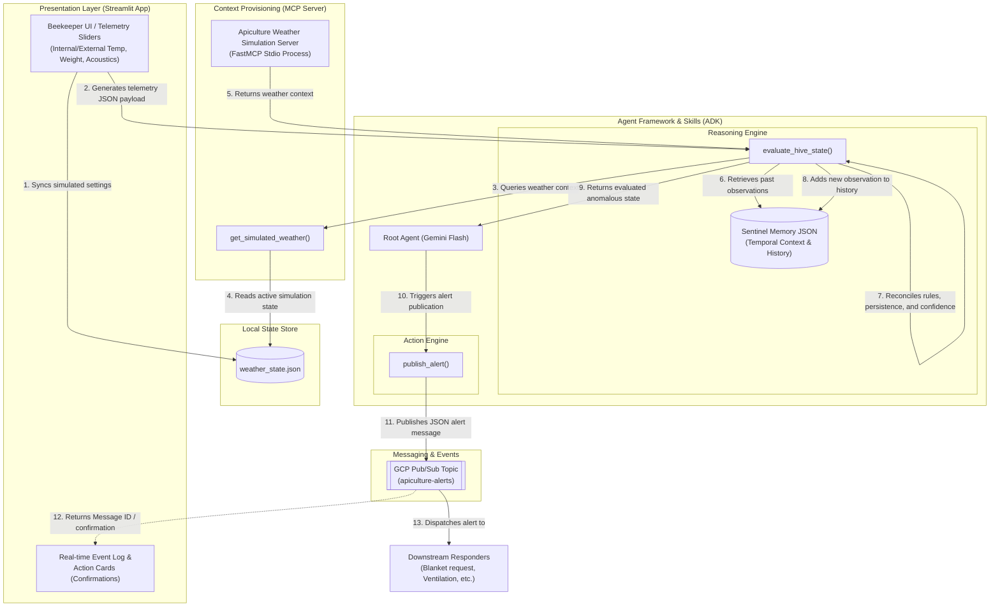

## The "Why" (Project Intent)

The goal is to build a realistic, data-driven Apiculture monitoring environment. The system uses a Multi-Agent system (via an ADK) and simulated IoT telemetry to proactively detect anomalies (swarming, pests, cold stress, queenlessness) and route alerts securely via Google Cloud Pub/Sub.

## Technical Stack & Visual Aids

**Backend & Agent Framework:** Python 3.12, utilizing an Agent Development Kit (ADK) for structured multi-agent reasoning, and bigframes for data handling.

**Context Provisioning:** Model Context Protocol (MCP) Server to dynamically feed telemetry schemas and spatial calculation rules to the agent.

**Presentation Layer:** Streamlit (containerized for Cloud Run).

**Messaging & Events:** Google Cloud Pub/Sub.

**Tooling & Build:** Antigravity (for seamless workspace/repo context indexing) and Agents CLI (for testing agent skills locally).

### System Architecture Flow

The system processes telemetry inputs, fetches external context, performs multi-agent reasoning, and dispatches alerts via the following architecture flow:



## Full Technical Design & Requirements

### 1. Deployability (Google Cloud Run)

To ensure high deployability and demonstrate cloud architectural skills, the agent backend and Streamlit interface will be deployed as a serverless container.

*Requirement:* Include a Dockerfile adhering to best practices (lightweight base image, non-root user).

**Architecture Focus:** Deployed to Google Cloud Run to seamlessly process discrete telemetry JSON payloads generated by user interactions within the Streamlit UI. The focus is on demonstrating precise agent logic, secure messaging, and a robust, production-ready architectural foundation.

### 2.Multi-Agent System (ADK) & Agent Skills

**Architecture:** The logic is decentralized into distinct "Agent Skills." The state_evaluator acts as the reasoning engine, while the pubsub_alerter acts as the action engine.

**Integration:** These skills are built to be invoked via an Agents CLI during local testing and orchestrated by the ADK in production.

**Agent-Tool-Action Matrix:**
To present a clean separation of roles to evaluators, the multi-agent design breaks down tasks as follows:

| Agent Component | Core Responsibility | Tools Utilized | Automated Action |
|---|---|---|---|
| **Sentinel Reasoning Agent** | Performs core colony health diagnosis and anomaly identification. | `evaluate_hive_state()`, `get_simulated_weather` (via MCP), `SentinelMemory` | Analyzes metrics, queries temporal history, and computes confidence score. |
| **Spatial Compliance Agent** | Validates physical layout requirements and hive crowding. | `ApiarySpatialManager.validate_layout()` | Computes Langstroth square-footage clearances and alerts on overcrowding. |
| **Alert Dispatch Agent** | Publishes validated critical anomalies to stakeholders. | `pubsub_alerter.publish_alert()` | Prepares JSON alerts and dispatches payloads to Google Cloud Pub/Sub. |

### 3. Environmental Strategy (The Provider Pattern & MCP)

**Architecture:** Implement a WeatherProvider abstract base class.

**MCP Server Integration:** Instead of hardcoding weather states or apiary locations, the agent queries a local MCP Server to fetch the current "SimulatedWeather" state, ensuring clean separation of data and logic.

**Standardized MCP Decoupling Layer:**
Using the Model Context Protocol (MCP) provides the agent with a standardized, protocol-level adapter to retrieve dynamic environmental context without hardcoding external APIs directly inside the reasoning logic. This decouples the agent's core decision-making loop from third-party weather or spatial provider systems, allowing you to swap mock simulation servers for live production feeds seamlessly without modifying the agent's code.

### 4. Streamlit Visual Representation & UI Design

To effectively demonstrate the AI Agent's logic to judges, the Streamlit web app utilizes dynamic multi-page navigation (`st.navigation`) organized into three main views:

*   **Home (home_landing.py):** Presents a high-level hero banner, dynamic KPI overview cards (Total Hives, Healthy, Warnings, Critical), and site health ratio bars.
*   **Fleet Dashboard (fleet_command.py):** Contains the live triage queue showing active warnings/critical events, and the Apiary Site Spatial Compliance audit panel.
*   **Hive Triage (hive_triage.py):** Provides the single-hive diagnostic workbench:
    *   **Sidebar / Input Panel:** Interactive select box for Edge Audio Sensor classification (Simulated), and sliders for Internal Temp (°C), External Temp (°C), and Hive Weight (kg). Moving these updates the simulated MCP state.
    *   **Main Canvas (Diagnostic Flow):** A step-by-step process indicator showing the logic execution: [Input Capture] -> [MCP Context Fetch] -> [Agent Reasoning] -> [Pub/Sub Alert Dispatch].
    *   **Main Canvas (Action Preview):** An "Action Card" that displays the Agent Decision, the resulting Automated Action, and confirmation status (e.g., Pub/Sub Message ID).
    *   **Main Canvas (Event Log):** A scrollable list at the bottom appending timestamps and state changes.
    *   **Human-in-the-Loop Review Form:** Allows beekeepers to submit feedback ratings and comment notes on agent decisions directly.

### 5. Spatial Planning (Location & Sizing)

The system provides an ApiarySpatialManager skill within the ADK to enforce hive placement rules:

**Standard Langstroth Hive Dimensions:** ~1.3 sq. feet per box footprint (16¼" W x 19⅞" L).

**Working Space Requirement:** Minimum 3 feet of space behind and on the sides of the hive; 5-10 feet of clear flight path in the front.

**Capacity Formula:** Total Sq Ft available / 20 = Maximum number of hives.

**Compliance Check:** The agent uses these dimensions to validate apiary layouts provided by the user via JSON context.

### 6. Acoustic & Telemetry Mock Data (JSON)

Instead of processing raw audio files, the system consumes JSON payloads representing standard Edge AI audio classifications. The system must recognize and react to these specific telemetry simulations:

**edge_acoustic_classification:** Acoustic classification (e.g., STEADY_HUM, PIPING_DETECTED, ERRATIC_MITE_STRESS, MOURNING_ROAR, QUIESCENT).

**internal_temp_c:** Internal temperature.

**hive_weight_kg:** Weight of the hive in kilograms.

## 7 Agentic Reasoning & Memory (Sentinel Layer)

The system utilizes an Agentic Reasoning Engine (the Sentinel Layer) that combines deterministic safety rules with contextual reasoning and memory-based decision making. It evolves based on observed colony history and temporal patterns.

### Agent Perception Loop

Every evaluation cycle, the agent runs a continuous perception-reasoning-action loop:

1. **Perceive**: Receives incoming apiary telemetry events (internal temperature, hive weight, edge acoustic classifications).
2. **Contextualize (MCP)**: Calls the MCP weather provider tool to fetch dynamic simulated weather conditions (external temperature, rain/sun).
3. **Remember**: Queries `SentinelMemory` to retrieve past observations, trend histories, and baseline constraints.
4. **Evaluate Hypotheses**: Reconciles the inputs against biological thresholds, checks temporal persistence filters, and runs multi-signal confidence matching.
5. **Decide**: Selects the appropriate colony health state categorization (e.g. `COLD_STRESS_ALERT`) and determines the required physical action.
6. **Act / Dispatch**: Invokes the Pub/Sub Action Engine to publish the alert payload to GCP.
7. **Learn / Persist**: Appends the final evaluation result and trace back into `SentinelMemory` to serve as context for the next cycle.

### AI Agent vs. Standard ML Classifier

To stand out in a capstone project evaluation, it is crucial to distinguish this AI Agent from a traditional machine learning classifier:

* **Traditional ML Classifier**: Receives raw inputs (e.g., `internal_temp = 38°C`, `weight = -3kg`) and outputs a static probability (e.g., `72% swarm probability`). It lacks memory, context awareness, self-explanation, or direct action-taking capabilities.
* **AI Agent**: Combines the raw observations with **context** (fetching MCP weather to see if high temperature aligns with sunny conditions) and **memory** (checking `SentinelMemory` to see if weight dropped suddenly without a corresponding crop harvest history). It performs structured step-by-step reasoning and dispatches a **targeted downstream action** (Pub/Sub alerts) while explaining its choice in human-readable terms.

### Agent Sentinel Trace Example

During app demonstration, the agent outputs a structured execution trace showing its step-by-step reasoning path:

```text
🧠 Sentinel Agent Trace:
• Observation: Internal Temp = 31.0°C, External Temp = -5.0°C, Weight = 40.0kg.
• Memory Retrieval: Stable weight; history shows no prior harvest events.
• Context (MCP): Sunny, Humidity: 50%.
• Reasoning: Internal temp has dropped below the brood regulatory range (< 32.0°C) due to freezing external conditions, threatening cluster viability.
• Decision: COLD_STRESS_ALERT
• Action: Publish Thermal Blanket Request
```

* **Temporal Memory (`persistence_requirement`):** The system enforces a temporal threshold (in hours) that a specific signal or state condition must be continuously observed before triggering an actionable event. This acts as a noise filter against momentary sensor glitches.
* **Signal Hierarchy:** Telemetry data is evaluated based on:
    * **Required Signals:** The primary diagnostic triggers (e.g., sustained weight loss). If these are not met, the state is invalidated.
    * **Supporting Signals:** Secondary data points (e.g., acoustic deviation) that increase the confidence score of the diagnosis.
* **Event Resolution:** The agent reconciles conflicting telemetry using a `multi_signal_confidence` strategy, ensuring higher-severity alerts override lower ones, and that minimum confidence thresholds are achieved before Pub/Sub dispatch.

### Confidence-Based Reasoning & Calibration

To move away from a "default-to-healthy" bias, the reasoning engine uses a dynamic, confidence-scaled evaluation model:

1. **First-Run Calibration Handling (Empty History)**
   - If `SentinelMemory` contains no baseline weight or history, the agent treats the first evaluation cycle as a calibration event.
   - Instead of defaulting to `NORMAL_HEALTHY`, it returns `INITIALIZING_MONITORING` with a base confidence score of `0.5` and a reasoning string: `"Insufficient temporal data; establishing baseline."`
   - **Exception / Priority Override**: If the raw telemetry delta is extreme (> 5kg), it immediately overrides the calibration state and returns `CATASTROPHIC_MASS_LOSS` with critical severity and a high-priority alert note: `"High-magnitude event detected; immediate attention required despite limited history."`

2. **Confidence Scaling Rules**
   - **Base Confidence**: Starts at `0.5` for first-run telemetry or the candidate's signal matching confidence score for historical runs.
   - **Memory Multiplier**: Increases the confidence score by `+0.2` if the hive has a recorded history of `> 6` hours in memory.
   - **HITL Feedback Integration**: Checks the local `feedback_log` for the most recent beekeeper feedback on the current hive:
     - If the user previously rated the agent as **Inaccurate** (accuracy rating <= 2), a `-0.2` confidence penalty is applied.
     - If the user rated it as **Highly Accurate** (accuracy rating = 5), a `+0.1` boost is applied.
   - The final confidence score is clamped within the range `[0.0, 1.0]`.

### Biological Rationale for Thresholds

The telemetry thresholds evaluated by the Sentinel layer and state evaluator are directly rooted in honeybee biology (specifically *Apis mellifera*):

#### A. Temperature Thermoregulation
* **Brood Nest Regulation (32°C - 36°C)**: The brood (eggs, larvae, and pupae) requires a very stable core temperature to develop normally. Worker bees dynamically thermoregulate this area.
  * *Below 32°C (Cold Stress)*: Leads to brood cooling, developmental defects, susceptibilities to parasites/diseases, or brood death. Worker bees will form a tight cluster and shiver their flight muscles to generate metabolic heat.
  * *Above 36°C (Heat Stress)*: Overheating is highly stressful to bees and destructive to the brood. Workers will begin active cooling behavior: fanning their wings at hive entrances, bringing water into the hive to cool it via evaporative cooling, or beard outside.
  * *Above 40°C (Critical Heat)*: Danger of structural collapse. Wax melts at around 62°C-64°C, but softens significantly above 40°C. Combs can collapse, drowning the brood in honey. Worker bees and brood suffer heat stroke and rapid protein denaturation, leading to colony collapse.

#### B. Acoustic & Vibration Frequency Profiles
Bees communicate and express collective state changes acoustically and vibrationally, which are classified by Edge AI DSP algorithms:
* **Steady Hum (Steady state / normal)**: Standard background sound of a calm, queenright hive with normal activity. Shows harmonic density centered around ~150–250 Hz representing standard flight muscle vibrations, ventilation, and social activities.
* **Piping (Pre-swarming alert)**: High-frequency pulses (typically ~400–500 Hz) produced by queens (either mother queens prepping to leave or newly emerged virgin queens). It signals rival queens of their presence, and coordinates worker behavior, announcing an imminent swarm departure.
* **Mourning Roar (Queenlessness)**: A distinct, uncoordinated, loud, and disorganized sound profile. The lack of Queen Mandibular Pheromone (QMP) triggers worker distress. The frequency shifts into a lower, flatter hum lacking clear harmonics (distressed mourning buzz), often between 200–250 Hz but characterized by sudden collective volume increases when the hive is disturbed.
* **Erratic Mite Stress (Varroa Pest Infestation)**: High mite loads irritate workers and weaken bees through hemolymph feeding. The colony exhibits a higher frequency of grooming vibrations, erratic buzzing patterns, and defensive wing-beat bursts, manifesting as irregular spikes in telemetry.

#### C. Hive Weight Dynamics
* **Swarming Departure (1.5kg - 5.0kg weight drop)**: A swarm consists of the laying queen and approximately 50-60% of the worker bees. Before leaving, bees gorge themselves on honey to fuel their flight. A sudden departure of thousands of honey-filled bees causes an immediate, rapid weight loss of 1.5kg to 5kg within minutes.
* **Catastrophic Mass Loss (>5.0kg weight drop)**: Biological weight changes (even major swarming or honey consumption) rarely exceed 5kg in a short time frame. A drop greater than 5kg indicates external, non-biological events like hive tipping, bear/predator attacks, honey theft, or wind-blown cover loss.

### Feature: Interactive Agent Logic Demonstration

  Scenario: Streamlit slider triggers cold stress alert
    Given the user slides the external temperature to -5°C
    And the internal temperature is set below 33°C
    When the Streamlit app generates the telemetry JSON
    Then the agent should evaluate the state as "COLD_STRESS_ALERT"
    And publish a "Thermal Blanket Request" to GCP Pub/Sub

  Scenario: High frequency DSP data triggers swarm alert
    Given the Edge Audio Sensor is set to "PIPING_DETECTED"
    When the telemetry JSON is processed
    Then the agent should log a "PRE_SWARMING_ALERT"
    And trigger a space inspection alert via Pub/Sub
    
  Scenario: Acoustic monitor detects queenless roar
    Given the Edge Audio Sensor is set to "MOURNING_ROAR"
    When the telemetry JSON is processed
    Then the agent should log a "QUEENLESS_COLONY" alert
    And trigger a Queen Replacement Alert via Pub/Sub

  Scenario: Swarm Departure Detection
    Given the hive weight drops by 3kg suddenly (e.g., from 40kg to 37kg).
    When the evaluate_hive_state tool is executed.
    Then the state should return SWARM_DEPARTURE_DETECTED and severity CRITICAL.

  Scenario: Catastrophic Mass Loss Detection
    Given the hive weight drops by more than 5kg suddenly (e.g., from 40kg to 28kg).
    When the evaluate_hive_state tool is executed.
    Then the state should return CATASTROPHIC_MASS_LOSS and severity CRITICAL.

  Scenario: Healthy Colony Thriving
    Given the hive weight is stable around 40kg.
    And the temperature is optimal (35°C).
    And the acoustic profile is "steady".
    And the agent logs the observation to the SentinelMemory for future context.
    When the evaluate_hive_state tool is executed.
    Then the state should return NORMAL_HEALTHY with LOW severity.
    
 Scenario: Hive Heat Stress
    Given the internal temperature rises to 38.0°C
    And the acoustic profile is "steady"
    When the telemetry JSON is processed
    Then the agent should log a "HEAT_STRESS_ALERT"
    And trigger a Hive Ventilation Alert via Pub/Sub

  Scenario: Critical Hive Heat
    Given the internal temperature exceeds 40.0°C (e.g., 41.5°C)
    And the hive is exposed to direct sunlight
    When the telemetry JSON is processed
    Then the agent should log a "CRITICAL_HEAT_ALERT"
    And trigger a Critical Cooling Request via Pub/Sub

## 8. Persistence Schemas & Data Storage

The Apiculture Monitoring Agent relies on two data storage structures:

### A. Sentinel Memory Persistence
Sentinel Memory provides the temporal context layer. Observations are captured in-memory or persisted as JSON records with the following schema:

| Field Name | Type | Description |
|---|---|---|
| `timestamp` | ISO-8601 String | ISO timestamp representing when the telemetry was evaluated. |
| `state` | String Enum | Target state classification (e.g., `NORMAL_HEALTHY`, `CATASTROPHIC_MASS_LOSS`, `COLD_STRESS_ALERT`). |
| `explanation` | String | Synthesized reasoning explanation generated by the agent. |
| `telemetry` | JSON Object | Nested JSON payload containing telemetry parameters (environmental and acoustic) captured at that time. |

### B. MCP Weather State File (`weather_state.json`)
Allows the frontend Streamlit UI and the local MCP server to share state dynamically:

```json
{
    "internal_temp_c": 35.0,
    "external_temp_c": 20.0,
    "conditions": "Sunny",
    "humidity": 50.0,
    "wind_speed_kmh": 10.0
}
```

### C. SQLite Database Schema (`fleet.db`)

Provides the persistent storage layer for the active fleet configuration and agent evaluations history.

#### 1. Table `hive_fleet`
Tracks the telemetry profiles and active diagnostic classifications for the entire colony population.

| Column | Type | Description |
|---|---|---|
| `hive_id` | TEXT (PK) | Unique identification code for the hive (e.g., `HIVE-0001`). |
| `site` | TEXT | Name of the apiary site where the hive is located (e.g., `apiary_site_1`). |
| `state` | TEXT | Current evaluated colony state (e.g., `NORMAL_HEALTHY`). |
| `severity` | TEXT | Urgency severity tag (`INFO`, `MEDIUM`, `HIGH`, `CRITICAL`). |
| `action` | TEXT | Active recommended response action (e.g., `Trigger Hive Ventilation Alert`). |
| `internal_temp_c` | REAL | Last recorded internal hive temperature sensor reading. |
| `external_temp_c` | REAL | Last recorded ambient outside temperature sensor reading. |
| `hive_weight_kg` | REAL | Last recorded hive total mass in kilograms. |
| `edge_acoustic_classification` | TEXT | Most recent Edge AI acoustic pattern identifier (e.g., `STEADY_HUM`). |
| `last_eval_ts` | TEXT | ISO-8601 timestamp of the last agent evaluation run. |

#### 2. Table `diagnostic_events`
Logs a chronological audit trail of all agent decision cycles.

| Column | Type | Description |
|---|---|---|
| `id` | INTEGER (PK AUTOINCREMENT) | Unique auto-incremented audit log entry ID. |
| `hive_id` | TEXT | Target hive identifier code. |
| `timestamp` | TEXT | ISO-8601 timestamp of when the reasoning cycle completed. |
| `evaluated_state` | TEXT | Resulting state decision from the evaluator. |
| `severity` | TEXT | Resulting severity category tag. |
| `confidence_score` | REAL | Confidence rating computed by the agent. |
| `pubsub_message_id` | TEXT | Dispatched Pub/Sub message ID confirmation (or `None`). |

#### 3. Table `feedback_log`
Persists beekeeper Human-in-the-Loop accuracy reviews. Used as the ground truth input for the confidence threshold adaptation loop.

| Column | Type | Description |
|---|---|---|
| `id` | INTEGER (PK AUTOINCREMENT) | Unique auto-incremented row ID. |
| `hive_id` | TEXT | Target hive identifier (e.g., `H-00100`). |
| `evaluated_state` | TEXT | The agent state being reviewed (e.g., `HEAT_STRESS_ALERT`). |
| `rating` | INTEGER (1–5) | Beekeeper accuracy rating: 1 = completely wrong, 5 = perfectly correct. |
| `comment` | TEXT | Optional qualitative beekeeper notes. |
| `timestamp` | TEXT | ISO-8601 timestamp of when the review was submitted. |

## 9. API Specifications (REST)

The backend service is powered by FastAPI, exposing default ADK routing endpoints along with custom telemetry feedback operations:

### A. Post Beekeeper Feedback
Logs rating and beekeeper qualitative feedback for continuous evaluation.

* **Endpoints:** `POST /api/v1/feedback` and `POST /feedback`
* **Request Headers:** `Content-Type: application/json`
* **Request Payload (JSON):**
  ```json
  {
      "rating": 4,
      "comment": "Correctly identified heat stress but the hive was already ventilated.",
      "hive_id": "H-00100",
      "evaluated_state": "HEAT_STRESS_ALERT"
  }
  ```
* **Response Payload (JSON):**
  ```json
  {
      "status": "success",
      "message": "Feedback logged successfully",
      "state": "HEAT_STRESS_ALERT",
      "rating": 4
  }
  ```

### B. Agent Telemetry Evaluation Endpoint
Integrates external tools or clients with the core Agentic reasoning flow, returning flat JSON evaluation outputs.

* **Endpoints:** `POST /api/v1/run` and `POST /run` (also exposes standard ADK streaming via `/agent/run` or `/run` stream sessions)
* **Request Headers:** `Content-Type: application/json`
* **Request Payload (JSON):**
  ```json
  {
      "input": "Evaluate apiary health with the current telemetry payload: { 'environmental_metrics': {'internal_temp_c': 35.0}, ... }"
  }
  ```
* **Response Payload (JSON):**
  ```json
  {
      "output": "The apiary is healthy and operating within normal parameters.",
      "history": [...]
  }
  ```

### C. HITL Feedback-to-Threshold Adaptation Loop

The system implements a closed-loop mechanism where beekeeper accuracy ratings directly adjust the confidence thresholds used by the state evaluator at runtime. This converts qualitative human judgment into quantitative model tuning without requiring a model retrain.

#### Flow

```
Beekeeper submits rating (1–5) via Node Triage HITL form
        │
        ▼
POST /api/v1/feedback  {rating, comment, hive_id, evaluated_state}
        │
        ▼
feedback_log table (fleet.db)  ← persisted permanently
        │
        ▼
get_feedback_confidence_overrides()  →  GROUP BY evaluated_state, AVG(rating)
  [only states with ≥ 3 reviews are eligible for override]
        │
        ▼
Rating → Threshold Mapping:
  avg ≥ 4.0  →  0.70  (agent trusted → lenient, more sensitive)
  avg 3.0–3.9 →  0.75  (default, no change)
  avg < 3.0   →  0.85  (agent unreliable → strict, needs stronger evidence)
        │
        ▼
telemetry_schema.json  ←  confidence_override per state updated
        │
        ▼
state_evaluator.py reads confidence_override at evaluation time
  state_threshold = state_def.get("confidence_override") or global_default (0.75)
```

#### Key Design Decisions

* **Minimum sample gate (`_MIN_FEEDBACK_COUNT = 3`):** Prevents a single outlier rating from destabilising the threshold. Overrides only activate after ≥ 3 independent reviews for a given state.
* **Non-destructive defaults:** All states default to `confidence_override: null` in `telemetry_schema.json`. The evaluator falls back to the global `min_confidence_threshold: 0.75` when no override is present, ensuring backward compatibility.
* **Durable schema write:** The `confidence_override` value is written back to `telemetry_schema.json` after every qualifying feedback submission, making the adaptation survive server restarts.
* **Separation of concerns:** Feedback storage (`database.py`), threshold computation (`database.py`), schema mutation (`main.py`), and threshold consumption (`state_evaluator.py`) are each handled by separate modules.

#### Threshold Override Schema (`telemetry_schema.json` excerpt)

```json
{
    "state_definitions": {
        "HEAT_STRESS_ALERT": {
            "required_signals": [...],
            "persistence_requirement": 2,
            "severity": "HIGH",
            "confidence_override": 0.70
        }
    },
    "event_resolution": {
        "min_confidence_threshold": 0.75,
        "required_signal_matching": true
    }
}
```

## 10. Dependency & Tooling Versions

The table below details the versions of key tools, frameworks, and library dependencies used in the project:

| Category | Tool / Library | Version | Scope / Purpose |
|---|---|---|---|
| **Environment / Build** | Python | `3.12` | Runtime Language Environment (Docker base image) |
| **Environment / Build** | uv | `0.8.13` | Ultra-fast Python package installer and resolver |
| **Agent Platform** | google-agents-cli (agents-cli) | `0.5.0` | Command line tool for scaffolding, evaluation, and deployment |
| **Agent Platform** | google-adk (Agent Development Kit) | `2.3.0` | Framework for multi-agent reasoning, skills, and orchestrating |
| **Context Protocol** | mcp (Model Context Protocol SDK) | `1.28.1` | Protocol for exposing weather and telemetry schemas to agent tools |
| **Presentation** | streamlit | `1.58.0` | Developer interface and interactive sliders for sensor values |
| **Cloud / Messaging** | google-cloud-pubsub | `2.39.0` | Pub/Sub messaging broker for event routing |
| **Cloud / Logging** | google-cloud-logging | `3.16.0` | Cloud Logging client for production audit trails |
| **Cloud / ML** | google-cloud-aiplatform | `1.158.0` | Vertex AI client SDK and LLM evaluation components |
| **Observability** | opentelemetry-instrumentation-google-genai | `0.7b1` | OpenTelemetry tracing instrumentation for Google GenAI calls |
| **Storage** | gcsfs | `2026.6.0` | Cloud Storage filesystem provider |

## 11. Error Scenarios, Resiliency & Edge Cases

The Apiculture Monitoring Agent is designed with fallback mechanisms to ensure high availability and prevent crashes when encountering malformed inputs or downstream system failures.

### A. Core Failure Scenarios & Mitigation Strategies

| Failure Scenario | Triggering Condition | Agent Resolution & Fallback Behavior |
|---|---|---|
| **Malformed / Missing Telemetry Payload** | Evaluator receives `None` or an empty JSON payload. | Catches the `ValueError` globally, returns a structured result with `state: "ERROR"`, `severity: "CRITICAL"`, and logs the trace to stdout/stderr. |
| **Missing Metric Fields** | Telemetry payload is missing specific sections like `acoustic_metrics` or `environmental_metrics`. | Employs a recursive dictionary search (`find_value_in_dict`) and applies safe biological defaults (e.g. 35.0°C internal temp, `STEADY_HUM` acoustic classification) to continue evaluation. |
| **MCP Weather Server Crash / Timeout** | Local MCP weather server process fails to spawn, time out, or returns invalid results. | The `MCPWeatherProvider` catches the exception and falls back to a standard baseline weather context (`external_temp_c: 20.0`, `conditions: "Sunny"`), allowing reasoning to continue uninterrupted. |
| **Pub/Sub Authentication / Connection Error** | Missing GCP credentials, network timeout, or service outage during alert dispatch. | The `pubsub_alerter` logs the warning, bypasses the GCP SDK publish, and falls back to generating a local mock message ID (`mock-msg-<uuid>`) to satisfy UI and testing hooks. |
| **Sentinel Memory Unavailability** | The transient memory context object is `None` or fails to retrieve history. | Evaluator defaults to a standard template containing basic historical patterns (e.g. standard April weight increases) and initializes an empty transient list of past observations. |

## 12. Architectural Refactor: Streamlit Monolith & Cloud Run Optimization

To resolve Cloud Run deployment blockers and simplify the cloud topology, the system was refactored from a multi-service setup (Streamlit + FastAPI) into a containerized **Streamlit Monolith**:

1. **Direct Skill Invocation (Bypassing the ADK Import Trap):** 
   - Backend APIs (FastAPI) were replaced with direct skill module invocations inside the Streamlit frontend.
   - To prevent triggering heavy, import-time ADK runtime initializations (such as starting MCP subprocesses, creating Vertex AI connections, or initializing Gemini clients) when importing sub-packages, a module-level `__getattr__` was implemented in `agent/__init__.py` to lazily import the ADK `app` instance.
   - Streamlit pages now utilize deep imports (e.g. `from agent.skills.state_evaluator import evaluate_hive_state`) safely.

2. **Ephemeral File System Resilience:**
   - On Cloud Run, the local disk is ephemeral and wipes on cold starts.
   - **Automatic Seeding:** `database.py` was updated to check for `fleet.db` upon import. If the database file is missing, it runs `seed_fleet_database()` to rebuild the 10,000 simulated hive records immediately.
   - **Configuration Fallbacks:** Built-in default JSON structures were added for `telemetry_schema.json`, `weather_state.json`, and `temperature_thresholds.json`. If any of these files are missing or wiped, they are automatically regenerated on the fly during module import.

3. **Dockerfile Overhaul:**
   - The `Dockerfile` was restructured to package the entire workspace.
   - Exposes port `8080` (expected by Cloud Run) and runs Streamlit directly via `uv run`.

4. **Confidence Score & Threshold UI Display:**
   - Updated the state evaluation return payload in `state_evaluator.py` to expose the dynamically computed `"confidence"` score.
   - Added a dedicated metrics display card below the **Detected State** showing the current evaluation's **Confidence Score** and the schema-defined **Active Threshold** (inclusive of runtime HITL overrides).

5. **Sentinel Memory Past Comparison:**
   - Integrated a historical audit comparison inside the **Learn More** expander panel.
   - It queries `SentinelMemory` to fetch the previous state observation and logs its synthetic explanation, allowing the user to track exactly when and why the state changed across multiple runs.

